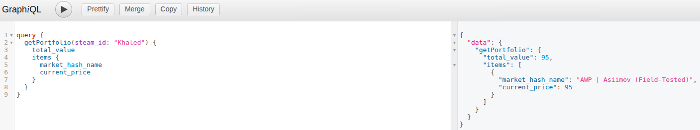
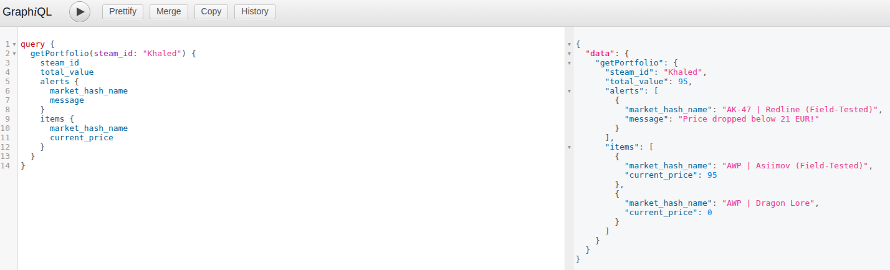
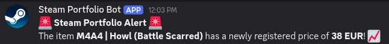
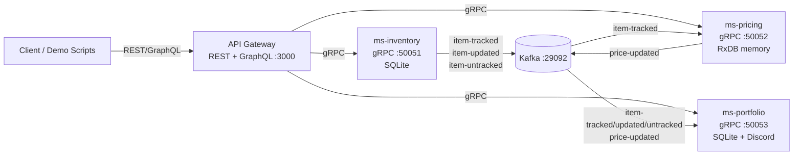

<h1 align="center">Steam Inventory Tracker</h1>
<p align="center">A demo-first, event-driven microservices system for tracking Steam inventory items, simulating prices, and emitting real-time alerts.</p>
<p align="center">
	
	
	
	
	
	
</p>
<p align="center">
	<a href="#quickstart">Quickstart</a> | <a href="#architecture-at-a-glance">Architecture</a> | <a href="#setup-and-run-local">Setup</a> | <a href="#usage">Usage</a> | <a href="#testing-manual">Testing</a>
</p>

## Quickstart
```bash
docker-compose up -d
npm install --prefix api-gateway
npm install --prefix ms-inventory
npm install --prefix ms-pricing
npm install --prefix ms-portfolio
```
Run services in separate terminals:
```bash
node ms-inventory/index.js
node ms-pricing/index.js
node ms-portfolio/index.js
node api-gateway/index.js
```
Open the GraphQL UI at http://localhost:3000/graphql.

## Project Status
- WIP / demo-oriented. The services run locally and focus on showcasing service boundaries, gRPC calls, and Kafka event flow.
- Pricing data is simulated (not pulled from Steam). This keeps the system deterministic and lightweight for demos.

## Highlights
- Track Steam inventory items by user id.
- Simulate price updates for tracked items.
- Emit Kafka events for inventory changes and price updates.
- Aggregate a user portfolio via GraphQL (inventory + current prices + alerts).
- Optionally push alerts to Discord via a webhook.

## Demo Snapshots
GraphQL portfolio queries and Discord alert samples from a local run:

<table>
	<tr>
		<td></td>
		<td></td>
		<td></td>
	</tr>
</table>

## Architecture At A Glance


## Service Map
| Service | Responsibility | Protocols | Default Port | Storage |
| --- | --- | --- | --- | --- |
| API Gateway | REST endpoints + GraphQL aggregation | HTTP, gRPC client | 3000 | None |
| ms-inventory | Track/update/untrack items | gRPC, Kafka producer | 50051 | SQLite (inventory.sqlite) |
| ms-pricing | Simulate prices and serve latest price | gRPC, Kafka consumer/producer | 50052 | RxDB in-memory |
| ms-portfolio | Portfolio alerts + Discord webhook | gRPC, Kafka consumer | 50053 | SQLite (portfolio.sqlite) |

## Data Flow (Events)
Kafka topics (all local):
- item-tracked
- item-updated
- item-untracked
- price-updated

Typical sequence:
1. A client tracks an item via the API Gateway.
2. ms-inventory stores it and emits item-tracked.
3. ms-pricing consumes item-tracked, simulates a price, stores it, then emits price-updated.
4. ms-portfolio consumes events and can send a Discord notification.

## API Surface (Overview)
This repo exposes three interfaces. Examples and test commands are below.

### REST (API Gateway)
- Track inventory item
- Get user inventory
- Update tracked item
- Untrack item
- Get item price

### GraphQL (API Gateway)
- getPortfolio(steam_id): returns inventory items, latest prices, and alerts
- trackItem(steam_id, market_hash_name): tracks an item via GraphQL

### gRPC (Internal Services)
- InventoryService (TrackItem, GetUserInventory, UpdateItem, UntrackItem)
- PricingService (GetItemPrice)
- PortfolioService (GetPortfolio)

## Ports & Endpoints (Local)
| Component | Address |
| --- | --- |
| API Gateway (REST + GraphQL) | http://localhost:3000 |
| GraphQL UI | http://localhost:3000/graphql |
| ms-inventory gRPC | 0.0.0.0:50051 |
| ms-pricing gRPC | 0.0.0.0:50052 |
| ms-portfolio gRPC | 0.0.0.0:50053 |
| Kafka (host) | localhost:29092 |
| Zookeeper (host) | localhost:22181 |

## Repository Layout
```
api-gateway/   # REST + GraphQL gateway
ms-inventory/  # inventory tracking service (SQLite + Kafka producer)
ms-pricing/    # pricing service (RxDB memory + Kafka consumer/producer)
ms-portfolio/  # alerts + Discord webhook service (SQLite + Kafka consumer)
protos/        # gRPC proto definitions
```

## Design Notes
- The pricing service uses an in-memory RxDB store, so prices reset on restart.
- Inventory and portfolio data are persisted locally in SQLite files inside each service folder.
- gRPC is used for service-to-service calls; REST and GraphQL are provided by the API Gateway for easy demo access.
- Kafka runs via docker-compose for local development only.

## Setup And Run (Local)
This repo has no top-level package.json. Install and run each service directly.

### Prerequisites
- Node.js 18+ (ms-portfolio uses global fetch)
- Docker + Docker Compose (for Kafka and Zookeeper)
- Open ports: 3000, 50051, 50052, 50053, 29092, 22181

### Install Dependencies
Run this once per service:
```bash
cd api-gateway && npm install
cd ../ms-inventory && npm install
cd ../ms-pricing && npm install
cd ../ms-portfolio && npm install
```

### Environment Variables
Only one env var is required for optional Discord alerts:
```bash
# ms-portfolio/.env
DISCORD_WEBHOOK_URL=https://discord.com/api/webhooks/your-webhook-here
```
Notes:
- This is optional. If missing, the portfolio service will just log a warning.
- Use a local .env and do not commit real webhook URLs.

### Start Kafka And Zookeeper
```bash
docker-compose up -d
```
You can check broker health with:
```bash
docker-compose logs -f kafka
```

### Run Services (4 terminals)
Start Kafka first, then services. From repo root:
```bash
node ms-inventory/index.js
```
```bash
node ms-pricing/index.js
```
```bash
node ms-portfolio/index.js
```
```bash
node api-gateway/index.js
```

### Local Data Files
- Inventory data: ms-inventory/inventory.sqlite
- Portfolio alerts: ms-portfolio/portfolio.sqlite
- Pricing data: in-memory RxDB only (resets on restart)

### Seed Data
On first run, ms-portfolio inserts a demo alert for:
- steam_id: Khaled
- item: AK-47 | Redline (Field-Tested)
- alert: Price dropped below 21 EUR!

### Defaults And Assumptions
- Kafka broker is assumed at localhost:29092.
- gRPC services are bound to 0.0.0.0 on ports 50051-50053.
- The API Gateway assumes gRPC services are on localhost with those ports.
- If you change ports or hostnames, update the service source code.

### Shutdown
- Stop services with Ctrl+C in each terminal.
- Stop Kafka/Zookeeper with:
```bash
docker-compose down
```

## Usage
<details>
<summary>REST (API Gateway)</summary>

All REST endpoints are exposed by the API Gateway on http://localhost:3000.

#### Track An Item
```bash
curl -X POST http://localhost:3000/api/inventory \
  -H "Content-Type: application/json" \
  -d '{"steam_id":"Khaled","market_hash_name":"AK-47 | Redline (Field-Tested)"}'
```

#### Get User Inventory
```bash
curl http://localhost:3000/api/inventory/Khaled
```

#### Update A Tracked Item
```bash
curl -X PUT http://localhost:3000/api/inventory \
  -H "Content-Type: application/json" \
  -d '{"steam_id":"Khaled","old_market_hash_name":"AK-47 | Redline (Field-Tested)","new_market_hash_name":"M4A1-S | Decimator (Field-Tested)"}'
```

#### Untrack An Item
```bash
curl -X DELETE http://localhost:3000/api/inventory \
  -H "Content-Type: application/json" \
  -d '{"steam_id":"Khaled","market_hash_name":"M4A1-S | Decimator (Field-Tested)"}'
```

#### Get Item Price
```bash
curl "http://localhost:3000/api/pricing/AK-47%20%7C%20Redline%20(Field-Tested)"
```
</details>

<details>
<summary>GraphQL</summary>

Open http://localhost:3000/graphql and run:
```graphql
query GetPortfolio {
  getPortfolio(steam_id: "Khaled") {
    steam_id
    total_value
    items {
      market_hash_name
      current_price
      currency
      last_updated
    }
    alerts {
      market_hash_name
      alert_type
      message
    }
  }
}
```

Track an item with a mutation:
```graphql
mutation TrackItem {
  trackItem(steam_id: "Khaled", market_hash_name: "AK-47 | Redline (Field-Tested)") {
    success
    message
  }
}
```
</details>

<details>
<summary>gRPC (grpcurl)</summary>

You can call the internal services directly with grpcurl. This is optional but useful for validating service boundaries.

Install grpcurl (one-time):
- macOS: brew install grpcurl
- Ubuntu: sudo apt-get install -y grpcurl

Examples (plain text):
```bash
grpcurl -plaintext -import-path protos -proto inventory.proto \
  localhost:50051 inventory.InventoryService/TrackItem \
  -d '{"steam_id":"Khaled","market_hash_name":"AK-47 | Redline (Field-Tested)"}'
```
```bash
grpcurl -plaintext -import-path protos -proto inventory.proto \
  localhost:50051 inventory.InventoryService/GetUserInventory \
  -d '{"steam_id":"Khaled"}'
```
```bash
grpcurl -plaintext -import-path protos -proto pricing.proto \
  localhost:50052 pricing.PricingService/GetItemPrice \
  -d '{"market_hash_name":"AK-47 | Redline (Field-Tested)"}'
```
```bash
grpcurl -plaintext -import-path protos -proto portfolio.proto \
  localhost:50053 portfolio.PortfolioService/GetPortfolio \
  -d '{"steam_id":"Khaled"}'
```
</details>

## Testing (Manual)
There are no automated tests yet. Use the matrix below to validate the full surface area.

| Area | Tool | Check |
| --- | --- | --- |
| REST | curl | Track, update, untrack, fetch inventory and price |
| GraphQL | GraphiQL | getPortfolio returns items, prices, and alerts |
| gRPC | grpcurl | InventoryService, PricingService, PortfolioService methods |
| Kafka | kafka-console-consumer | item-tracked, item-updated, item-untracked, price-updated |
| Discord | Webhook | Alerts arrive on track, update, price update |

### REST API Checks
1. Track an item (POST /api/inventory)
2. Get inventory and confirm it includes the new item (GET /api/inventory/:steam_id)
3. Update a tracked item (PUT /api/inventory)
4. Untrack the item (DELETE /api/inventory)
5. Fetch pricing (GET /api/pricing/:market_hash_name)

### GraphQL Checks
1. Run trackItem to add an item via GraphQL
2. Run getPortfolio for the same steam_id
3. Confirm items include prices and alerts are included

### gRPC Checks
1. Use grpcurl to call InventoryService methods
2. Use grpcurl to call PricingService/GetItemPrice
3. Use grpcurl to call PortfolioService/GetPortfolio

### Kafka Flow Checks
You can observe events directly from the Kafka container.
```bash
docker-compose exec kafka kafka-console-consumer \
	--bootstrap-server kafka:9092 \
	--topic item-tracked --from-beginning
```
Repeat for:
- item-updated
- item-untracked
- price-updated

### Discord Webhook Checks (Optional)
1. Set DISCORD_WEBHOOK_URL in ms-portfolio/.env
2. Track an item and wait for a message to post in your Discord channel
3. Update or untrack the item and confirm new alerts arrive

## Troubleshooting
- Kafka errors on startup: ensure docker-compose is running and broker is reachable at localhost:29092.
- gRPC connection failures: confirm each service is running on its port and not blocked by another process.
- GraphQL returns empty items: ensure you have tracked items for the given steam_id.
- No Discord messages: verify DISCORD_WEBHOOK_URL is set and the webhook is valid.

## Roadmap Ideas
- Add automated tests (REST, GraphQL, gRPC) and a unified test script.
- Replace mock pricing with live Steam market pricing.
- Containerize all services for one-command startup.
